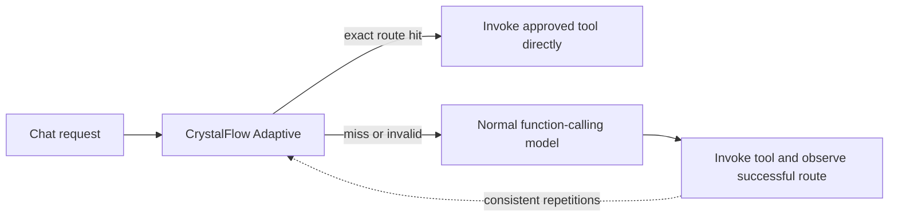

# CrystalFlow for Dify

CrystalFlow Adaptive learns repeated successful Agent tool calls and turns them into deterministic
routes. After the same request has produced the same approved tool call enough times, later exact
matches invoke that tool directly and skip the Agent model.

Users chat normally; they do not need CrystalFlow-specific prompts. A route stores the selected tool
and validated arguments, not the answer, so live data is fetched on every hit.

```text
First matching requests:
user query -> Agent model -> get_sop(sop_id="SOP-42") -> current SOP content

Later exact matches:
user query -> route crystal -> get_sop(sop_id="SOP-42") -> current SOP content
                              no Agent model call
```

## Install and configure

1. Install `crystalflow.difypkg` from **Plugins → Install via local file**.
2. Add an **Agent** node to a Chatflow or Workflow.
3. Choose **CrystalFlow Adaptive** as its Agent Strategy.
4. Select the model and tools the Agent normally uses.
5. Under **Safe direct-answer tools**, select only read-only tools whose output is ready to return
   directly to the user.
6. Keep the default activation threshold of five for normal use.

The `.difypkg` declares only the Agent Strategy plugin type. Dify does not permit Agent Strategy and
Tool providers in the same package. The manifest's tool permission lets the strategy invoke tools
selected in the Agent node; it does not register a second plugin type.

## Test automatic crystallization

For a quick test, use a read-only Workflow-as-Tool such as `get_sop`:

1. Set **Repetitions before activation** to `2`.
2. Put `get_sop` in both **Tools** and **Safe direct-answer tools**.
3. Ask exactly `What is in SOP-42?` three times in the same app and conversation context.
4. The first two requests should use the cold model path.
5. The third request should report a route hit with `llm_calls: 0`.

Use a stable tool input such as `sop_id`. A useful Knowledge Base bridge is a published
Workflow-as-Tool containing a Knowledge Retrieval node, deterministic formatting, and an Output
node.

The fast-path tool must be answer-ready. If the selected tool returns raw search results that still
need model summarization, it should not be allowlisted. If the tool internally invokes a model,
embedding model, or reranker, CrystalFlow saves the Agent model call but cannot make the complete
request zero-token.

## Matching behavior

The current release intentionally uses normalized exact requests. `What is in SOP-42?` can become a
route after consistent observations.

A context-dependent request such as `What is in that SOP?` stays on the model path unless the Agent
node receives a stable routing context such as `selected_sop_id`. The same applies to requests such
as `Show my PTO balance`, which need a stable user or tenant binding.

Routes are scoped to the app, instruction, available tool set, and optional routing context.
Changing a tool contract invalidates its old route. Conflicting tool choices or arguments quarantine
the route instead of guessing.

## Where token savings come from



On a valid hit, CrystalFlow reports zero Agent LLM calls. Tool output and authorization remain live
because the current configured tool is still invoked.

## Safety boundary

Route crystals contain only:

- a request and scope fingerprint;
- one approved tool identity;
- schema-validated JSON arguments;
- a tool-contract fingerprint; and
- aggregate observation, hit, and estimated-savings counters.

CrystalFlow does not run model-authored Python or JavaScript. It does not store tool credentials,
tool output, retrieved SOP content, the original request, or complete conversation history. Only
read-only, direct-answer tools explicitly selected by the workflow author are eligible for the warm
path.

## Requirements

- Dify 1.14.2 or newer
- an LLM configured in the Dify workspace for cold requests
- at least one suitable read-only tool for routes that should crystallize

Python 3.12, the Dify Plugin CLI, and [`uv`](https://docs.astral.sh/uv/) are needed only for
development.

## Develop and package

```bash
uv sync --frozen
cp .env.example .env
# Add the remote debug URL/key from Dify's Plugin Management page.
uv run python -m main
```

Run the checks and build a local package:

```bash
uv run pytest
uv run ruff check .
uv run ruff format --check .
dify plugin package .
```

Install the resulting `.difypkg` from **Plugins → Install via local file**. Production packages
should be signed with the Dify Plugin CLI.

The project pins the Dify SDK to the `0.9.x` compatibility line and commits `uv.lock`.

### Publish from GitHub

After pushing the repository, open **Actions → Package and release → Run workflow** and use tag
`v0.3.3`. The workflow runs all release checks, downloads the pinned official Dify CLI, builds
`crystalflow.difypkg`, and attaches it to the matching GitHub Release.

Dify Cloud manages signatures centrally. Self-hosted Dify enforces signature verification by
default, so its administrator should follow
[Dify's third-party signing guide](https://docs.dify.ai/en/develop-plugin/publishing/standards/third-party-signature-verification).

## Data handling

The strategy stores hashed request and scope identifiers, the approved tool identity,
model-supplied arguments, tool-contract fingerprints, consistency counters, and aggregate
hit/savings estimates in Dify's plugin KV storage. See [PRIVACY.md](PRIVACY.md).

## Support

Report bugs and request features through the
[CrystalFlow issue tracker](https://github.com/BegovicBenjamin/Crystalflow-Dify/issues).

## License

MIT
