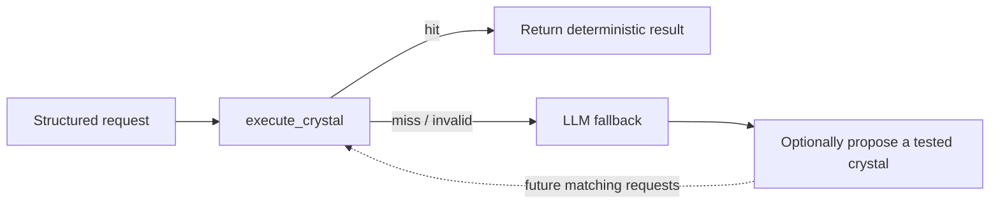

# CrystalFlow for Dify

CrystalFlow lets a Dify chatbot turn a proven repetitive task into a small, versioned,
deterministic program—a **crystal**—and reuse it without asking a model to recompute the answer.

A crystal is deliberately narrow:

```text
canonical JSON input -> Crystal IR v1 -> canonical JSON output
```

Good candidates include pricing rules, scoring, validation, normalization, payload construction,
fixed templates, and rule-based classification. Open-ended writing, subjective judgment, live
research, and side effects are not crystals.

## Where the token savings come from

The zero-model-token warm path is a Dify Workflow or Chatflow:



`execute_crystal` never invokes a model. When it returns `hit`, the workflow can answer directly.
When it returns `miss`, `invalid_input`, or `error`, route to the existing LLM path.

An Agent still spends model tokens deciding to call a tool. Agent use can save repeated reasoning
and generation, but only an explicit Workflow/Chatflow fast path can skip the model call entirely.
CrystalFlow does not transparently intercept conversations.

## Safety boundary

CrystalFlow does **not** run model-authored Python or JavaScript. A chatbot may propose only
Crystal IR: a closed JSON expression tree interpreted by the plugin.

- No `eval`, `exec`, imports, subprocesses, reflection, or dynamic calls
- No network, filesystem, environment, clock, randomness, or locale access
- Strict input/output schemas and exact test vectors
- Bounded AST depth, operation budget, collection sizes, and output size
- Canonical JSON and SHA-256 program/execution receipts
- Immutable versions with recoverable retirement
- Only Dify workspace KV storage permission; no credentials or external service

The same program hash, engine version, and canonical input produce the same output bytes.

## Tools

| Tool | Purpose |
|---|---|
| `crystallize` | Validate a Crystal IR program against exact tests, save an immutable version, and optionally activate it |
| `execute_crystal` | Run the active version and return a hit/miss contract suitable for a conditional workflow branch |
| `crystal_status` | List the workspace-local catalog or inspect one crystal and its savings telemetry |
| `activate_crystal` | Promote an exact test-passing version after its name, version, and hash are approved |
| `retire_crystal` | Recoverably disable an obsolete or unsafe version after explicit name confirmation |

Mutation tools should be enabled only in a controlled builder/admin workflow. Do not expose them
to a general-purpose Agent: because a model can populate both a target and its confirmation, those
checks prevent mistakes and stale updates but cannot prove user approval. Normal production
workflows need only `execute_crystal` and optionally `crystal_status`.

## Requirements

- Dify 1.14.2 or newer
- Python 3.12
- The current [Dify Plugin CLI](https://docs.dify.ai/en/develop-plugin/getting-started/cli)
- [`uv`](https://docs.astral.sh/uv/) for reproducible local development

## Develop and install

```bash
uv sync --frozen
cp .env.example .env
# Add the remote debug URL/key from Dify's Plugin Management page.
uv run python -m main
```

For a local package:

```bash
dify plugin package .
```

Install the resulting `.difypkg` from **Plugins → Install via local file**. Production packages
should be signed with the Dify Plugin CLI.

The project intentionally pins the Dify SDK to the `0.9.x` compatibility line and commits
`uv.lock`.

## Configure a fast path

1. Add `execute_crystal` as the first tool node for a known stable task.
2. Set a non-secret `namespace` in the node's form configuration. Use the same namespace on the
   admin crystallization node.
3. Pass a stable `crystal_name` and strict JSON input.
4. Branch on `status`:
   - `hit`: parse/use `result_json` and answer directly.
   - anything else: run the normal LLM path.
5. Keep downstream side effects in ordinary Dify tool nodes. A crystal may construct their typed
   payload, but may not perform them.

The namespace is application organization, not an access-control boundary. Dify scopes plugin KV
storage to a workspace and plugin identity, and records can persist across upgrades or
reinstallation. Every app with this plugin and namespace can access the same crystals.

## Let a chatbot create a crystal

Give a trusted builder agent the `crystallize` tool and instructions similar to:

> Crystallize only pure, repetitive tasks with structured inputs and exact outputs. Propose Crystal
> IR v1, include boundary tests, and never encode subjective judgment, secrets, external calls, or
> side effects. Use `execute_crystal` before recomputing a known crystal. Treat every non-hit as a
> fallback, not as an answer.

The `activation_policy` and `namespace` are Dify form fields, so the chatbot cannot change them.
The safe default is `draft`. Promote a reviewed draft with `activate_crystal`, which requires the
exact program hash. If a builder deliberately selects `activate_after_tests`, all supplied tests
must pass before a version can become active.

See [Crystal IR v1](docs/CRYSTAL_IR_V1.md) for the language and
[examples](examples/) for ready-to-run programs and test vectors.

## Lifecycle and current scope

Version 0.1.0 implements:

```text
proposal -> static validation -> exact tests -> draft/active -> deterministic hits -> new version
```

It does not yet mine conversation history, semantically discover matching crystals, run a shadow
evaluation phase, or autonomously promote candidates. Those features require explicit data
retention, ownership, and approval policy; they should not be silently inferred by a plugin.

Dify's documented KV interface has no enumeration transaction or compare-and-swap operation.
CrystalFlow therefore stores immutable version records, maintains a best-effort catalog index, and
serializes mutations within each plugin worker process. For high-availability administration with
multiple worker processes, use a single admin writer or replace the MVP registry with a
transactional external store.

## Data handling

Programs and their test vectors are stored because they are the audit evidence for a version.
Runtime inputs and outputs are not stored; only aggregate hit and estimated-token counters are.
See [PRIVACY.md](PRIVACY.md).

## Test

```bash
uv run pytest
uv run ruff check .
```

The core engine and registry use only the Python standard library. The Dify SDK is needed only by
the plugin adapters.

## Support

Report bugs and request features through the
[CrystalFlow issue tracker](https://github.com/BegovicBenjamin/Crystalflow-Dify/issues).

## License

MIT
