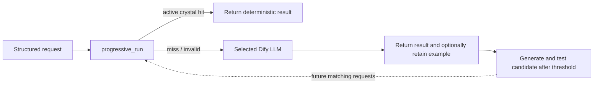

# CrystalFlow for Dify

CrystalFlow gives a Dify Workflow one model-backed node that can turn a repeated, structured task
into a small deterministic program—a **crystal**—and reuse it without calling the model again.

A crystal is deliberately narrow:

```text
canonical JSON input -> Crystal IR v1 -> canonical JSON output
```

Good candidates include pricing rules, scoring, validation, normalization, payload construction,
fixed templates, and rule-based classification. Open-ended writing, subjective judgment, live
research, and side effects are not crystals.

## Quick start: one node

Install CrystalFlow, create a Workflow or Chatflow, and add **Progressive run**:

```text
Structured JSON input -> Progressive run -> Answer / End
```

Configure these fields once on the node:

- **Task key:** a stable name such as `invoice_total`
- **Task description:** the exact JSON transformation and valid domain
- **Model:** any LLM already configured in the Dify workspace
- **Enable learning:** opt in to retaining bounded examples for this task
- **Examples before crystallizing:** five by default
- **Learning policy:** create a reviewed draft, or explicitly auto-activate for low-risk tasks

Connect the current JSON input to `input_json`. On a cold request, the selected model returns the
JSON result. After enough distinct examples, the same model proposes Crystal IR; CrystalFlow
validates it against every retained example and stores a draft or active version according to the
policy. On future compatible requests, the active crystal returns `result_json` without a model
call.

CrystalFlow binds each stored candidate to a fingerprint of the task key and task description.
Changing either starts a separate learning record instead of silently running an older
transformation. The node exposes that bound identifier as `crystal_name` for advanced lifecycle
tools.

The node reports `status: fallback` while the model handles a cold request and `status: hit` when a
crystal handles it. `model_tokens_used` is actual SDK-reported usage for the current node run and is
zero on a hit.

### Try it in three runs

For a quick, low-risk demo, use:

- **Namespace:** `quick_test_v02`
- **Task key:** `add_values`
- **Task description:** `Given integer x and y, return exactly {"total": x + y}.`
- **Enable learning:** on
- **Examples before crystallizing:** `2`
- **Learning policy:** `Auto-activate after observed tests (low-risk demo only)`
- **Input JSON:** connect a text input containing strict JSON

Run the workflow with `{"x":2,"y":3}`, then `{"x":5,"y":7}`. Those cold runs should report
`status: fallback`; the second can also report `learning_status: candidate_active`. Run it a third
time with `{"x":8,"y":9}`. A successfully generalized crystal reports `status: hit`,
`result_json: {"total":17}`, and `model_tokens_used: 0`. If candidate generation is rejected, the
node safely keeps using the selected model and explains the state in `learning_status`.

Use the default threshold of five and **Draft for review** for production work. Auto-activation
checks consistency with observed examples; it does not prove correctness for unseen inputs.

CrystalFlow needs a stable task key and structured input to make the warm path deterministic.
Discovering intent or extracting fields from arbitrary natural-language chat generally requires a
model and therefore cannot guarantee a zero-token route.

## Where the token savings come from

`progressive_run` owns both paths:



The advanced `execute_crystal` tool also never invokes a model. When it returns `hit`, a workflow
can answer directly; non-hits require a surrounding fallback.

An Agent still spends model tokens deciding to call a tool. Agent use can save repeated reasoning
and generation, but only a Workflow/Chatflow that invokes `progressive_run` before an Agent or LLM
can produce a genuinely zero-model-token hit.

## Safety boundary

CrystalFlow does **not** run model-authored Python or JavaScript. A chatbot may propose only
Crystal IR: a closed JSON expression tree interpreted by the plugin.

- No `eval`, `exec`, imports, subprocesses, reflection, or dynamic calls
- No network, filesystem, environment, clock, randomness, or locale access
- Strict input/output schemas and exact test vectors
- Bounded AST depth, operation budget, collection sizes, and output size
- Canonical JSON and SHA-256 program/execution receipts
- Immutable versions with recoverable retirement
- Only Dify workspace model and KV storage permissions; no credentials requested directly

The same program hash, engine version, and canonical input produce the same output bytes.

## Tools

| Tool | Purpose |
|---|---|
| `progressive_run` | One-node experience: execute a crystal, invoke the selected model on a miss, retain opted-in examples, and generate a tested candidate |
| `crystallize` | Validate a Crystal IR program against exact tests, save an immutable version, and optionally activate it |
| `execute_crystal` | Run the active version and return a hit/miss contract suitable for a conditional workflow branch |
| `crystal_status` | List the workspace-local catalog or inspect one crystal and its savings telemetry |
| `activate_crystal` | Promote an exact test-passing version after its name, version, and hash are approved |
| `retire_crystal` | Recoverably disable an obsolete or unsafe version after explicit name confirmation |

The five advanced lifecycle tools are for controlled builder/admin workflows. Do not expose their
mutation operations to a general-purpose Agent: because a model can populate both a target and its
confirmation, those checks prevent mistakes and stale updates but cannot prove user approval.

## Requirements

- Dify 1.14.2 or newer
- An LLM configured in the Dify workspace for cold requests and candidate generation

Python 3.12, the Dify Plugin CLI, and [`uv`](https://docs.astral.sh/uv/) are needed only for plugin
development—not to install or use the GitHub release in Dify.

## Develop and install

```bash
uv sync --frozen
cp .env.example .env
# Add the remote debug URL/key from Dify's Plugin Management page.
uv run python -m main
```

For a local package:

```bash
dify plugin package .
```

Install the resulting `.difypkg` from **Plugins → Install via local file**. Production packages
should be signed with the Dify Plugin CLI.

The project intentionally pins the Dify SDK to the `0.9.x` compatibility line and commits
`uv.lock`.

### Publish from GitHub without a local CLI

After pushing the repository, open **Actions → Package and release → Run workflow**. Keep the tag
at `v0.2.0`. The workflow reruns every release check, downloads the pinned official Dify CLI, builds
`crystalflow.difypkg`, and attaches it to the matching GitHub Release.

In Dify, choose **Plugins → Install Plugin → From GitHub**, enter this repository URL, and select
the released version.

The release package is unsigned. Dify Cloud manages signatures centrally. Self-hosted Dify
enforces signature verification by default, so its administrator must follow
[Dify's third-party signing guide](https://docs.dify.ai/en/develop-plugin/publishing/standards/third-party-signature-verification)
or explicitly change that installation's verification policy.

## Advanced explicit fast path

1. Add `execute_crystal` as the first tool node for a known stable task.
2. Set a non-secret `namespace` in the node's form configuration. Use the same namespace on the
   admin crystallization node.
3. Pass a stable `crystal_name` and strict JSON input.
4. Branch on `status`:
   - `hit`: parse/use `result_json` and answer directly.
   - anything else: run the normal LLM path.
5. Keep downstream side effects in ordinary Dify tool nodes. A crystal may construct their typed
   payload, but may not perform them.

The namespace is application organization, not an access-control boundary. Dify scopes plugin KV
storage to a workspace and plugin identity, and records can persist across upgrades or
reinstallation. Every app with this plugin and namespace can access the same crystals.

## Advanced builder Agent

Give a trusted builder agent the `crystallize` tool and instructions similar to:

> Crystallize only pure, repetitive tasks with structured inputs and exact outputs. Propose Crystal
> IR v1, include boundary tests, and never encode subjective judgment, secrets, external calls, or
> side effects. Use `execute_crystal` before recomputing a known crystal. Treat every non-hit as a
> fallback, not as an answer.

The `activation_policy` and `namespace` are Dify form fields, so the chatbot cannot change them.
The safe default is `draft`. Promote a reviewed draft with `activate_crystal`, which requires the
exact program hash. If a builder deliberately selects `activate_after_tests`, all supplied tests
must pass before a version can become active.

See [Crystal IR v1](docs/CRYSTAL_IR_V1.md) for the language and
[examples](examples/) for ready-to-run programs and test vectors.

## Lifecycle and current scope

Version 0.2.0 implements:

```text
cold model result -> opted-in bounded examples -> IR proposal -> exact validation
                  -> reviewed draft / explicit auto-activation -> deterministic hits
```

The progressive node learns only within its configured task key. It does not mine unrelated
conversation history, semantically guess which task a free-form prompt represents, or execute
model-authored Python/JavaScript. Repeating an input with conflicting model outputs quarantines
learning for that task instead of silently choosing one answer.

Passing retained examples proves consistency with those examples, not correctness for every
possible input. **Draft for review** is the safe default. Explicit auto-activation is intended only
for low-risk transformations where the workflow owner accepts that limitation. Version 0.2.0 does
not yet provide hidden holdout tests, a shadow evaluation window, semantic routing, or a bulk-purge
tool.

Dify's documented KV interface has no enumeration transaction or compare-and-swap operation.
CrystalFlow therefore stores immutable version records, maintains a best-effort catalog index, and
serializes mutations within each plugin worker process. For high-availability administration with
multiple worker processes, use a single admin writer or replace the MVP registry with a
transactional external store.

## Data handling

Programs and their test vectors are stored because they are the audit evidence for a version.
Normal `execute_crystal` inputs and outputs are not stored. `progressive_run` retains a bounded set
of JSON inputs and model outputs only when **Enable learning** is explicitly enabled. Cold-path
inputs and retained examples are sent to the selected Dify model. See [PRIVACY.md](PRIVACY.md).

## Test

```bash
uv run pytest
uv run ruff check .
```

The core engine and registry use only the Python standard library. The Dify SDK is needed only by
the plugin adapters.

## Support

Report bugs and request features through the
[CrystalFlow issue tracker](https://github.com/BegovicBenjamin/Crystalflow-Dify/issues).

## License

MIT
